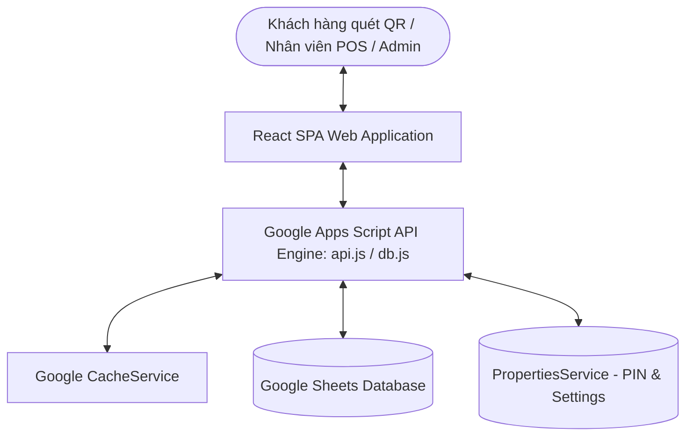
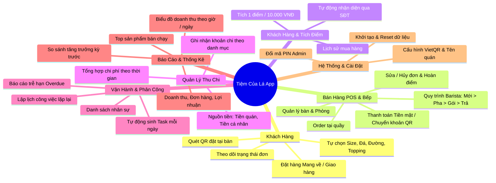

# TÀI LIỆU ĐẶC TẢ HỆ THỐNG PHẦN MỀM — TIỆM CỦA LÁ (TCLApp v3.3)
**Google Apps Script Full POS & F&B Shop Management System**

---

## 1. TỔNG QUAN DỰ ÁN (PROJECT OVERVIEW)

### 1.1 Giới thiệu
**Tiệm Của Lá (TCLApp)** là hệ thống phần mềm quản lý bán hàng (POS), vận hành quầy pha chế, quản lý bàn/phòng, phân công công việc nhân viên, theo dõi thu chi và báo cáo doanh thu toàn diện dành cho quán cà phê, trà sữa, F&B.

Hệ thống được phát triển trên nền tảng **Google Workspace (Google Apps Script + Google Sheets Database)** kết hợp giao diện hiện đại **React SPA (Single Page Application)**, mang lại giải pháp không tốn chi phí máy chủ (Serverless), dễ dàng triển khai, sao lưu và đồng bộ dữ liệu theo thời gian thực.

### 1.2 Kiến trúc công nghệ (Tech Stack)
- **Backend**: Google Apps Script (V8 Runtime)
- **Database**: Google Sheets (Quản lý qua `SpreadsheetApp`, tối ưu hiệu năng bằng `CacheService`)
- **Frontend**: React 19 SPA, Tailwind CSS / Vanilla CSS, Lucide Icons, Chart Components
- **Hosting / Deployment**: Google Apps Script Web App (chạy chế độ `USER_DEPLOYING` với quyền truy cập `ANYONE`)
- **Xác thực & Bảo mật**: Phân quyền qua mã PIN quản trị viên (Admin PIN) lưu trong `PropertiesService`, mã hóa chống XSS qua bộ lọc tham số URL (`sanitizeUrlParam`).

---

## 2. CẤU TRÚC DỮ LIỆU GOOGLE SHEETS (DATABASE SCHEMA)

Cơ sở dữ liệu được tổ chức thành 10 bảng (Sheets) chuẩn hóa:

| Tên Sheet | Mô tả | Các trường thông tin (Columns) |
| :--- | :--- | :--- |
| **`Products`** | Danh mục món / sản phẩm | `ID`, `Name`, `Category`, `Price`, `Image`, `HasSize`, `HasIce`, `HasSugar`, `Status` |
| **`Toppings`** | Danh sách topping kèm | `ID`, `Name`, `Price`, `Status` |
| **`Tables`** | Quản lý bàn / phòng | `ID`, `Name`, `Status`, `Capacity`, `QR_URL` |
| **`Orders`** | Thông tin đơn hàng | `ID`, `TableID`, `TotalAmount`, `Status`, `Source`, `OrderType`, `CustomerID`, `CustomerName`, `CustomerPhone`, `DeliveryAddress`, `CreatedAt`, `Note` |
| **`Order_Details`** | Chi tiết món trong đơn | `ID`, `OrderID`, `ProductID`, `ProductName`, `Size`, `Ice`, `Sugar`, `Toppings`, `Quantity`, `Price`, `Subtotal` |
| **`Customers`** | Danh sách & Tích điểm KH | `ID`, `Name`, `Phone`, `Type`, `Company`, `Address`, `Email`, `Points`, `TotalSpent`, `CreatedAt`, `Note` |
| **`Expenses`** | Sổ quỹ chi phí | `ID`, `Date`, `Category`, `Description`, `Amount`, `Note`, `FundingSource`, `PerformedBy`, `PerformedByName` |
| **`Staff`** | Quản lý nhân viên | `ID`, `Name`, `Status` |
| **`TaskTemplates`** | Mẫu lịch công việc định kỳ | `ID`, `Title`, `Description`, `AssignedTo`, `AssignedName`, `RepeatType`, `RepeatEvery`, `Priority`, `StartDate`, `Status` |
| **`TaskInstances`** | Thực thi công việc theo ngày | `ID`, `TemplateID`, `Title`, `AssignedTo`, `AssignedName`, `DueDate`, `Priority`, `Status`, `CompletedAt`, `CompletedBy`, `Note` |

---

## 3. CÁC PHÂN HỆ VÀ ĐẶC TẢ TÍNH NĂNG CHI TIẾT

---

### PHÂN HỆ 1: GỌI MÓN & TRẢI NGHIỆM KHÁCH HÀNG (CUSTOMER SELF-ORDER)
1. **Quét mã QR tại bàn (`?table=TBLxx`)**:
   - Tự động nhận diện số bàn khi khách truy cập liên kết QR.
   - Tải danh mục menu công khai (`menu_pub`) với tốc độ cao nhờ bộ nhớ đệm Cache 5 phút.
2. **Tùy biến món (Customization)**:
   - **Size**: S (Nhỏ - +0đ), M (Vừa - +3.000đ), L (Lớn - +6.000đ).
   - **Đá**: 100% Đá, 70% Đá, 50% Đá, Ít đá, Không đá.
   - **Đường**: 100% Đường, 70% Đường, 50% Đường, Ít ngọt, Không đường.
   - **Topping**: Chọn nhiều loại topping cùng lúc (Thạch lá, Sương sáo, Trân châu trắng, Trân châu Olong, Thạch phô mai, Full topping...).
3. **Hình thức đặt hàng**:
   - `DINE_IN` (Dùng tại bàn - Tự động cập nhật bàn sang trạng thái `OCCUPIED`).
   - `TAKEAWAY` (Mang về).
   - `DELIVERY` (Giao hàng tận nơi - nhập Tên, SĐT, Địa chỉ nhận hàng).
4. **Theo dõi đơn hàng (Live Tracking)**:
   - Khách có thể xem trạng thái đơn: Chờ xác nhận → Đang pha chế → Đang đóng gói → Đang phục vụ / Hoàn thành.

---

### PHÂN HỆ 2: ĐIỀU HÀNH BÁN HÀNG & QUẦY PHA CHẾ (POS & KITCHEN DISPLAY)
1. **Màn hình Order tại quầy**:
   - Thêm món nhanh, tìm kiếm món theo danh mục, tính tổng tiền tức thì.
   - Ghi chú riêng cho từng đơn (ví dụ: *ít ngọt, cho thêm ống hút*).
2. **Quy trình trạng thái đơn hàng (Order State Machine)**:
   - `NEW` (Đơn mới đặt).
   - `PREPARING` (Đang pha chế).
   - `PACKING` (Đang đóng gói).
   - `SERVING` (Đang phục vụ mang ra bàn).
   - `COMPLETED` (Đã thanh toán & hoàn tất).
   - `CANCELLED` (Đã hủy đơn).
3. **Chỉnh sửa & Hủy đơn linh hoạt (`editOrder`, `cancelOrder`)**:
   - Cho phép chỉnh sửa số lượng, món ăn, ghi chú khi đơn ở trạng thái `NEW`, `PREPARING`, `PACKING`.
   - Tự động bù/trừ điểm tích lũy của khách hàng nếu giá trị đơn thay đổi sau chỉnh sửa.
   - Tự động hoàn lại điểm tích lũy đã trừ nếu đơn bị hủy.
4. **Thanh toán thông minh (`checkoutOrder`)**:
   - Hỗ trợ đa phương thức: Tiền mặt (`CASH`), Chuyển khoản VietQR (`TRANSFER`), hoặc kết hợp.
   - Tự động sinh cú pháp thanh toán ghi vào Note đơn hàng: `[TT:CASH] TM:50000 Tips:5000`.
   - Tự động giải phóng bàn (`FREE`) nếu bàn không còn đơn nào khác đang phục vụ.
   - Tích điểm tự động cho khách hàng theo tỉ lệ: **10.000 VNĐ = 1 điểm**.

---

### PHÂN HỆ 3: QUẢN LÝ BÀN / PHÒNG & MÃ QR (TABLE MANAGEMENT)
1. **Sơ đồ bàn trực quan**:
   - Hiển thị danh sách bàn kèm trạng thái: `FREE` (Trống), `OCCUPIED` (Có khách), `RESERVED` (Đã đặt trước).
   - Đếm số lượng đơn hàng đang active trên từng bàn (`ActiveOrderCount`).
2. **Tác vụ quản lý bàn**:
   - Thêm bàn mới (tự động sinh mã `TBL01`, `TBL02`...), sức chứa khách (`Capacity`).
   - Xóa bàn, đổi trạng thái cưỡng bức (`resetTable` về `FREE`).
   - Tích hợp link Web App tự động tạo mã QR riêng cho từng bàn.

---

### PHÂN HỆ 4: QUẢN LÝ KHÁCH HÀNG & TÍCH ĐIỂM (CRM & LOYALTY)
1. **Quản lý thông tin khách hàng**:
   - Lưu trữ: Tên, SĐT, Phân loại (`Cá nhân`/`Doanh nghiệp`), Công ty, Địa chỉ, Email, Ghi chú.
   - Tự động tạo hồ sơ khách hàng mới khi phát sinh đơn hàng qua SĐT.
2. **Tìm kiếm & Lịch sử mua sắm**:
   - Tìm kiếm nhanh khách hàng theo số điện thoại (Partial match).
   - Xem tổng chi tiêu trọn đời (`TotalSpent`), tổng điểm tích lũy (`Points`).
   - Xem toàn bộ lịch sử các đơn hàng đã đặt cùng chi tiết từng món.

---

### PHÂN HỆ 5: QUẢN LÝ THU CHI (EXPENSE MANAGEMENT)
1. **Ghi chép chi phí (`addExpense`)**:
   - Phân loại danh mục chi: *Nguyên vật liệu, Tiền điện nước, Mặt bằng, Lương nhân viên, Dụng cụ, Khác...*
   - Nguồn tiền thanh toán: *Tiền quán, Tiền cá nhân, Tiền quỹ...*
   - Ghi nhận người thực hiện chi (`PerformedBy`, `PerformedByName`).
2. **Báo cáo & Tổng hợp chi phí (`getExpenseSummary`)**:
   - Xem danh sách chi tiêu trong ngày hoặc theo khoảng ngày tùy chọn.
   - Bảng tổng hợp chi phí phân nhóm theo danh mục kèm tỷ trọng và tổng số tiền (`grandTotal`).
   - Sửa, xóa khoản chi trực tiếp từ giao diện.

---

### PHÂN HỆ 6: QUẢN LÝ NHÂN SỰ & CÔNG VIỆC VẬN HÀNH (TASK MANAGEMENT - v3.2)
1. **Quản lý danh sách nhân sự (`Staff`)**:
   - Thêm mới, đổi tên, ngừng kích hoạt nhân viên (`ACTIVE` / `INACTIVE`).
2. **Lập lịch công việc định kỳ (`TaskTemplates`)**:
   - Thiết lập công việc lặp lại tự động với các chế độ:
     - `daily`: Hàng ngày (mỗi ngày đều chạy).
     - `every_x`: Lặp lại mỗi $X$ ngày một lần.
     - `weekly`: Thứ cố định trong tuần (T2, T3, ..., Chủ Nhật).
     - `biweekly`: 2 tuần một lần vào thứ chỉ định.
     - `monthly`: Ngày cố định hàng tháng (ví dụ: ngày 1 hoặc 15 hàng tháng).
   - Gán người chịu trách nhiệm (`AssignedTo`), mức độ ưu tiên (`high`, `medium`, `low`), ngày bắt đầu.
   - Tạm dừng (`PAUSED`) hoặc kích hoạt lại (`ACTIVE`) template bất kỳ lúc nào.
3. **Bảng công việc hàng ngày (`TaskInstances`)**:
   - Cơ chế **Auto-generation**: Mỗi ngày hệ thống tự động kiểm tra lịch và sinh danh sách task cụ thể cho ngày hôm đó.
   - Tự động mang theo các task tồn đọng chưa hoàn thành từ hôm qua và gắn cờ cảnh báo trễ hạn (`isOverdue = true`).
   - Nhân viên thực hiện bấm: **Hoàn thành (`DONE`)** hoặc **Bỏ qua (`SKIPPED`)** kèm ghi chú lý do.

---

### PHÂN HỆ 7: BÁO CÁO KINH DOANH & PHÂN TÍCH (ANALYTICS & BI)
1. **Bộ chỉ số kinh doanh chính (KPIs)**:
   - **Doanh thu thuần (Total Revenue)**: Tổng tiền các đơn `COMPLETED`.
   - **Tổng số đơn (Total Orders)** & **Giá trị trung bình/đơn (AOV - Average Order Value)**.
   - **Tổng chi phí (Total Expenses)**: Tổng các khoản chi trong kỳ.
   - **Lợi nhuận ròng (Net Profit)** = $\text{Doanh thu} - \text{Chi phí}$.
2. **Phân tích chi tiết**:
   - **Biểu đồ xu hướng ngày (Daily Trend)**: Doanh thu và số lượng đơn theo từng ngày.
   - **Phân bổ doanh thu theo giờ (Hourly Peak-hour Breakdown)**: Nhận biết khung giờ cao điểm trong ngày (từ 0h - 23h).
   - **Top 10 sản phẩm bán chạy (Top Products)**: Xếp hạng theo số lượng ly và doanh số thu về.
   - **Phân loại nhóm món (Product Category Breakdown)**: Thống kê chi tiết món theo từng nhóm đồ uống.
3. **So sánh kỳ trước (Growth Comparison)**:
   - Tự động lấy khoảng thời gian tương đương liền kề trước đó để tính % tăng trưởng doanh thu (`revenueGrowth`).

---

### PHÂN HỆ 8: CẤU HÌNH HỆ THỐNG & BẢO MẬT (SYSTEM & SETTINGS)
1. **Bảo mật mã PIN Admin**:
   - Mặc định: `1234` (Lưu an toàn trong `ScriptProperties`).
   - Hỗ trợ đổi PIN bảo vệ các khu vực nhạy cảm: Menu Admin, Quản lý giá, Báo cáo tài chính, Xóa dữ liệu.
2. **Cấu hình thanh toán VietQR & Thông tin quán**:
   - Tên quán (`SHOP_NAME`).
   - Mã ngân hàng (`BANK_ID` - ví dụ: 970436 cho Vietcombank).
   - Số tài khoản (`ACCOUNT_NO`) & Tên chủ tài khoản (`ACCOUNT_NAME`).
   - Hệ thống tự động tạo mã QR VietQR chuẩn khi khách thanh toán chuyển khoản.
3. **Khởi tạo dữ liệu mẫu (Seeding & Migration)**:
   - `doGet?action=setup`: Khởi tạo cấu trúc bảng, thêm cột mới nếu thiếu, nạp sẵn menu mẫu và danh sách bàn mẫu.
   - `doGet?action=resetmenu`: Khôi phục lại menu gốc ban đầu.

---

## 4. BẢNG TỔNG HỢP DANH SÁCH API (BACKEND ENDPOINTS)

| Nhóm API | Tên hàm Backend | Tên Alias Frontend | Mô tả nghiệp vụ |
| :--- | :--- | :--- | :--- |
| **Auth** | `verifyPin(pin)` | `verifyPin` | Xác thực quyền quản trị |
| | `changePin(oldPin, newPin)` | `changePin` | Đổi mã PIN quản trị |
| **Settings** | `getSettings()` | `getSettings` | Lấy tên quán, thông tin TK ngân hàng |
| | `saveSettings(data)` | `saveSettings` | Lưu thông tin ngân hàng & quán |
| | `getAppUrl()` | `getAppUrl` | Lấy URL triển khai Web App |
| **Menu** | `getMenu()` | `getMenu` | Lấy menu món đang ACTIVE cho khách |
| | `getMenuAdmin()` | `getMenuItems` | Lấy toàn bộ món cho quản trị viên |
| | `addProduct(data)` | `addMenuItem` | Thêm món mới vào menu |
| | `updateProduct(id, data)`| `updateMenuItem` | Cập nhật tên, giá, ảnh, thuộc tính món |
| | `deleteProduct(id)` | `deleteMenuItem` | Xóa món khỏi thực đơn |
| | `addTopping(data)` | `addTopping` | Thêm topping mới |
| | `updateTopping(id, data)`| `updateTopping` | Sửa giá/tên topping |
| | `deleteTopping(id)` | `deleteTopping` | Xóa topping |
| **Order** | `submitOrder(payload)` | `createOrder` | Tạo đơn hàng mới |
| | `getOrders()` | `getActiveOrders` | Lấy các đơn đang phục vụ (NEW..SERVING) |
| | `getOrderStatus(orderId)` | `getOrderById` | Kiểm tra chi tiết 1 đơn hàng |
| | `getOrderHistory(params)`| `getOrderHistory` | Lấy lịch sử đơn COMPLETED/CANCELLED |
| | `updateOrderStatus(id,st)`| `updateOrderStatus` | Cập nhật trạng thái pha chế/phục vụ |
| | `editOrder(payload)` | `updateOrder` | Sửa món, số lượng của đơn đang chờ |
| | `checkoutOrder(id, pay)` | `checkoutOrder` | Hoàn thành đơn & lưu thông tin trả tiền |
| **Tables** | `getTables()` | `getTables` | Lấy danh sách bàn & số đơn active |
| | `addTable(data)` | `addTable` | Thêm bàn mới |
| | `deleteTable(id)` | `deleteTable` | Xóa bàn |
| | `resetTable(tableId)` | `resetTable` | Reset trạng thái bàn về FREE |
| | `updateTableStatus(id,st)`| `updateTableStatus`| Đổi trạng thái FREE / OCCUPIED / RESERVED |
| **Expense**| `addExpense(data)` | `addExpense` | Thêm khoản chi tiêu |
| | `getExpenses(date)` | `getExpenses` | Lấy danh sách chi trong ngày |
| | `updateExpense(id, data)`| `updateExpense` | Cập nhật thông tin khoản chi |
| | `deleteExpense(id)` | `deleteExpense` | Xóa khoản chi |
| | `getExpenseSummary(p)` | `getExpenseSummary` | Tổng hợp chi phí theo danh mục & khoảng ngày |
| **Report** | `getReport()` | `getReport` | Báo cáo nhanh doanh thu hôm nay |
| | `getReportByRange(p)` | `getRevenueReport` | Báo cáo kinh doanh đầy đủ theo khoảng ngày |
| **Customer**| `getCustomers()` | `getCustomers` | Danh sách khách hàng xếp theo chi tiêu |
| | `searchCustomer(phone)` | `searchCustomers` | Tìm kiếm khách hàng theo SĐT |
| | `saveCustomer(data)` | `saveCustomer` | Thêm mới hoặc sửa thông tin khách |
| | `getCustomerHistory(id)` | `getCustomerOrders` | Lấy lịch sử đơn hàng của 1 khách |
| **Staff** | `getStaff()` | `getStaff` | Lấy danh sách nhân viên ACTIVE |
| | `addStaff(data)` | `addStaff` | Thêm nhân viên mới |
| | `updateStaff(data)` | `updateStaff` | Sửa tên / trạng thái nhân viên |
| | `deactivateStaff(id)` | `deactivateStaff` | Vô hiệu hóa nhân viên |
| **Tasks** | `getTaskTemplates()` | `getTaskTemplates` | Danh sách mẫu lịch công việc |
| | `addTaskTemplate(data)` | `addTaskTemplate` | Tạo lịch công việc định kỳ mới |
| | `updateTaskTemplate(d)` | `updateTaskTemplate`| Sửa cấu hình lặp lại, người phụ trách |
| | `deleteTaskTemplate(id)`| `deleteTaskTemplate`| Xóa template |
| | `toggleTaskTemplate(id)`| `toggleTaskTemplate`| Tạm dừng / Kích hoạt lại template |
| | `getTasksForToday()` | `getTasksForToday` | Lấy task hôm nay (tự động sinh & check overdue) |
| | `completeTask(id, note)`| `completeTask` | Đánh dấu hoàn thành task |
| | `skipTask(id, note)` | `skipTask` | Đánh dấu bỏ qua task kèm lý do |

---

## 5. ĐẶC ĐIỂM KỸ THUẬT NỔI BẬT (TECHNICAL HIGHLIGHTS)

1. **Hiệu năng & Tối ưu Quota Google Apps Script**:
   - Sử dụng `CacheService` với thời gian sống 300 giây cho Menu và 1800 giây cho Cài đặt.
   - Tự động xóa cache (`invalidateCache`) ngay khi có thao tác Ghi (`appendRow`, `updateRow`, `deleteRow`).
   - Giảm hơn 80% thời gian đọc dữ liệu từ Sheets, giúp giao diện phản hồi mượt mà dưới 1 giây.
2. **Cơ chế Alias Bridge chống đứt gãy kết nối**:
   - Tầng `api.js` trang bị các hàm Alias cầu nối giữa các tên hàm chuẩn Frontend và Backend mà không làm gián đoạn bản build SPA.
3. **Xử lý An toàn Lỗi (Defensive Error Handling)**:
   - Toàn bộ hàm API được bao bọc bởi hàm `withErrorHandling(fn)`. Bất kỳ lỗi logic nào xảy ra đều được log lại Stackdriver và trả về JSON chuẩn `{ success: false, error: "Chi tiết lỗi" }`, ngăn chặn tình trạng sập WebApp phía client.
4. **Bảo mật URL Parameters**:
   - Tham số URL trong iframe GAS được lọc qua `sanitizeUrlParam` trước khi inject vào DOM, ngăn chặn triệt để tấn công XSS.
